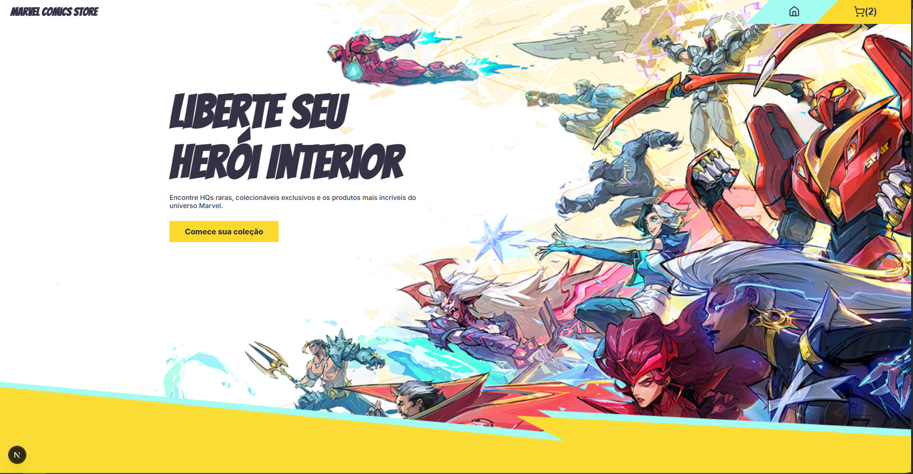

<h1 align="center">Marvel comics store</h1>
<h4 align="center">Uma loja de quadrinhos fictícia</h4>

<div align="center">

  [Tecnologias](#tecnologias)| [Instalação](#instalacao)


</div>




<div id="Sobre">


<div id="tecnologias">


### 🛠 Tecnologias

As seguintes ferramentas foram usadas na construção do projeto:

#### Front-end
- [Next](https://nextjs.org/)
- [cypress](https://www.cypress.io/)
- [styled-components](https://styled-components.com/)
- [Typescript](https://www.typescriptlang.org/)
- [Redux](https://redux.js.org/)


</div>

<br/>


## Requisitos

### Funcionalidades


Requisitos Funcionais
Estes são os requisitos que descrevem o que o sistema deve fazer.

Requisitos Essenciais:
RF1: O sistema deve exibir uma listagem paginada de histórias em quadrinhos (HQ's).

RF2: O sistema deve permitir a visualização individual de uma HQ em uma página dedicada.

RF3: O sistema deve possuir um carrinho de compras.

Requisitos Opcionais:
RF4: Na listagem de HQ's, o sistema deve marcar aleatoriamente 10% dos quadrinhos como "raros" ao carregar a página.

RF5: O carrinho de compras deve permitir a inserção de um cupom de desconto.

RF6: O sistema deve realizar a validação do cupom de desconto usando uma lógica "mock", sem a necessidade de uma API externa.

RF7: O sistema deve aplicar cupons "comuns" apenas a HQ's que não são marcadas como "raras".

RF8: O sistema deve aplicar cupons "raros" apenas a HQ's marcadas como "raras".


<div id="instalacao">


### Pré-requisitos
Antes de começar, você vai precisar ter instalado em sua máquina as seguintes ferramentas:

- [Git](https://git-scm.com),
- [Node.js](https://nodejs.org/en/).
- [VSCode](https://code.visualstudio.com/)

### Clonar o código
```Bash

# Clone este repositório
$ git clone https://github.com/aldovani/neo-app-front-end-test

```

### 🎲 Antes de rodar a aplicação

é necessário setar as varável de ambiente

```env

MARVEL_API_URL=
MARVEL_API_PUBLIC_KEY=
MARVEL_API_PRIVATE_KEY=

```

### 💻 Rodando o Front End (web)

```bash

# Vá para a pasta web
$ cd neo-app-front-end-test

# Instale as dependências
$ npm install

# Execute a aplicação em modo de desenvolvimento
$ npm run dev

# O servidor inciará na porta:3000 - acesse <http://localhost:3000>
```

</div>

### Autor
---

<a href="https://aldovani.github.io/portfolio/">
 
 <br />
 <sub><b>Aldovani</b></sub></a> <a href="https://aldovani.github.io/portfolio/" ></a>


Feito com ❤️ por Aldovani Henrique 👋 Entre em contato!

